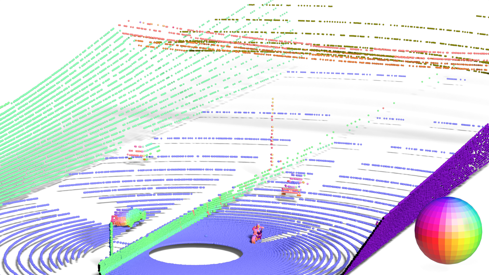
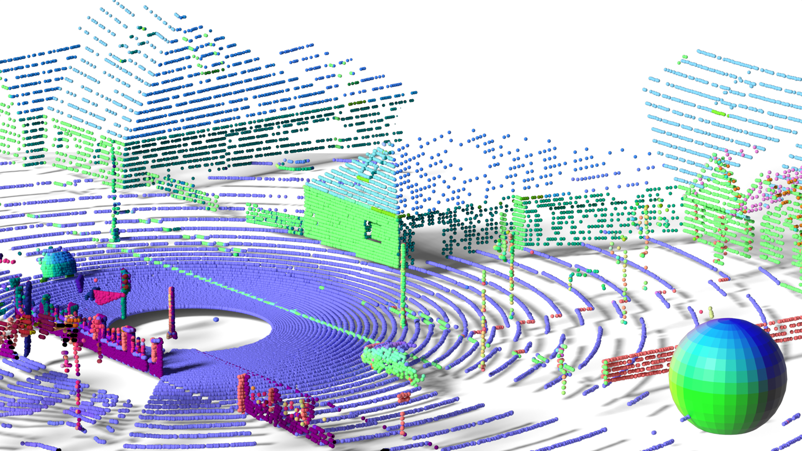

# LiSu: A Dataset and Method for LiDAR Surface Normal Estimation

Accepted at CVPR 2025.

    
    

  
Abstract

While surface normals are widely used to analyse 3D scene geometry, surface normal estimation from LiDAR point clouds remains severely underexplored. This is caused by the lack of large-scale annotated datasets on the one hand, and lack of methods that can robustly handle the sparse and often noisy LiDAR data in a reasonable time on the other hand. We address these limitations using a traffic simulation engine and present LiSu, the first large-scale, synthetic LiDAR point cloud dataset with ground truth surface normal annotations, eliminating the need for tedious manual labeling. Additionally, we propose a novel method that exploits the spatiotemporal characteristics of autonomous driving data to enhance surface normal estimation accuracy. By incorporating two regularization terms, we enforce spatial consistency among neighboring points and temporal smoothness across consecutive LiDAR frames. These regularizers are particularly effective in self-training settings, where they mitigate the impact of noisy pseudo-labels, enabling robust real-world deployment. We demonstrate the effectiveness of our method on LiSu, achieving state-of-the-art performance in LiDAR surface normal estimation. Moreover, we showcase its full potential in addressing the challenging task of synthetic-to-real domain adaptation, leading to improved neural surface reconstruction on real-world data.

  
  

Coming soon...
